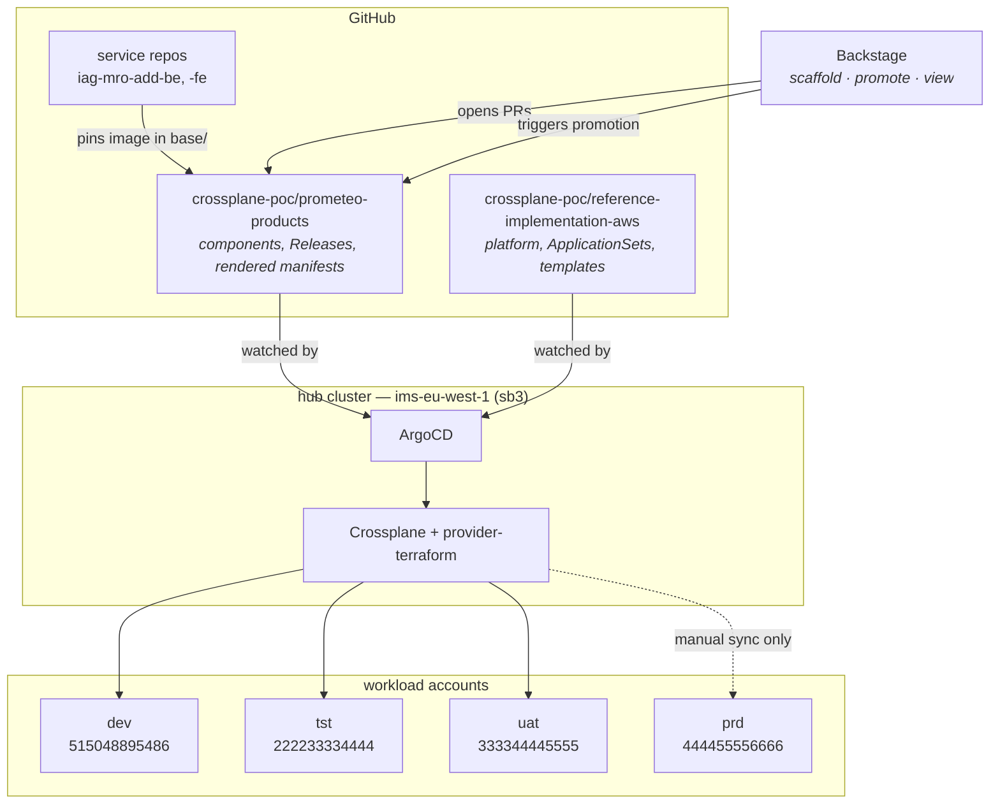

# Multi-environment deployment and promotion

How a product gets from a developer's pull request to production, through `dev → tst → uat → prd`,
with Backstage as the front door and ArgoCD as the thing that actually deploys.

This document explains how it works, how to stand it up, and what is left to do.
[`MULTI-ENV-ALTERNATIVES.md`](./MULTI-ENV-ALTERNATIVES.md) covers the choices we made and what we
would have got instead.

> [!NOTE]
> This is the implementation of the target recommended in
> [`environments_and_promotion.md`](./environments_and_promotion.md), which is the analysis that
> came first: where the pipeline is today, the five decisions, and what other people do. It is
> still the better document to read for *why an environment ladder at all*. The vocabulary here
> matches it deliberately — `base/`, `envs/<env>/release.yaml`, `envs/<env>/overrides.yaml`.
>
> Two things here are new since that analysis: **`componentsRevision`**, without which only
> images promote and configuration does not (§3), and **committed rendered manifests**, which is
> what makes a promotion pull request show the actual change (§4).

---

## 1. The problem

Today one cluster runs one copy of each product. A Backstage template opens a pull request,
someone merges it, someone syncs ArgoCD, and infrastructure appears. There is exactly one of
everything, so there is nothing to promote.

Four environments changes the question from *"what does this product look like"* to *"what does
this product look like **here**"*. Two things have to move between environments together:

- **the components** — the services, databases and buckets a product is made of, and their
  settings;
- **the image versions** — which build of each service is running. These live in the component
  files, so they move with the components rather than separately.

And two things must *not* move: the environment's own facts (account, VPC, domain) and its own
settings — replicas, database size, retention, log level, feature flags. Production must not
inherit dev's replica count or dev's debug logging because someone promoted a release. How that
split is expressed is §5.

---

## 2. The shape



**One ArgoCD, four clusters, four AWS accounts.** Hub-and-spoke: the hub holds ArgoCD and
Crossplane; each rung is its own account and its own EKS cluster. The hub reaches a spoke by
assuming a role in that account — there are no stored cluster credentials anywhere.

Today dev *is* the hub cluster, because the PoC has one cluster. That is a label on a Secret, not
a structural fact: when a real dev account exists, move the `prometeo.iag.ai/rung: dev` label onto
that cluster and nothing else changes.

`prd` is already separated as far as it can be inside one ArgoCD — its own ApplicationSet, its own
AppProject, no automatic sync. Moving it to a **second ArgoCD** is the recommended next step and
is discussed in the alternatives document.

---

## 3. The three files

Everything hangs off one idea: **a component manifest contains no environment**.

```yaml
# products/add/base/kosbucket.yaml — the whole file
apiVersion: platform.prometeo.iag.ai/v1alpha1
kind: ObjectStore
metadata: { name: kosbucket, namespace: add }
spec:
  product: add
  expirationDays: 15
  access:
    - { service: kosbackend, level: ro }
```

No account. No region. No bucket name. Those come from the cluster it lands on, out of that
cluster's `EnvironmentConfig`, at the moment Crossplane renders it:

```
bucket = <product>-<last 4 of account id>-<environment>-<name>
```

Apply that file in dev and you get `add-5486-sb3-kosbucket`. Apply the *same bytes* in prd and you
get `add-6666-prd-kosbucket`. **This is why promotion is a file copy** rather than a rewrite, and
it is the single most important property of the design. It was already true before this work —
it is what made a promotion model cheap to build.

So each environment needs three inputs, and produces one output:

| file | holds | who writes it | promoted? |
|---|---|---|---|
| `products/<p>/base/*.yaml` | what the product is made of, images included | Backstage; build pipelines | with the commit |
| `products/<p>/envs/<e>/release.yaml` | **which commit of `base/`, and which components** | `promote.py` | **yes, as one unit** |
| `products/<p>/envs/<e>/overrides.yaml` | how big it is here, and how it is configured here | a person | **never** |
| `products/<p>/rendered/<e>/*.yaml` | what ArgoCD applies | `render.py` | output |

### The Release is the unit of promotion

```yaml
# products/add/envs/tst/release.yaml
spec:
  componentsRevision: 6b94535…        # which commit's component files
  components: [backend, database, frontend, kosbackend, media, namespace, product, statics]
  promotedFrom: { environment: dev, release: a5fd44d7c70a, at: …, by: albert }
```

Two fields, and both matter:

**`componentsRevision` is pinned.** tst renders the component files *as they were at that commit*,
not as they are on `main` today. Without this, editing `base/backend.yaml` would change
production at the next render — a config change reaching prd having passed through no environment
at all. With it, an edit is live in dev immediately and reaches tst only when someone promotes.

That pin is also what makes it safe to keep auto-merging Backstage's pull requests.

**The image comes with the commit.** It is not recorded here. A component file carries its own
`spec.image`, so pinning the commit pins the image — tst runs the image `base/` held at tst's
commit. Build pipelines write that field with a digest as well as a tag: a tag is a label someone
can move, `:dev` moves every build, and the digest is the bytes that passed the rung below. So
"tested in tst" and "running in prd" are the same artefact, provably, and the Release does not
have to say so twice.

An earlier version of this design recorded an image map here as well. It was redundant the moment
`componentsRevision` existed, and the duplication cost more than it was worth: a renderer that had
to know which kinds carry images (and silently dropped the pin for kinds it did not know), an
empty map that the build tooling could not parse, and a scaffolder editing YAML with regular
expressions.

**It moves whole.** You cannot promote just the frontend. The combination of component set and
the images they carry is what was tested one rung down; promoting a subset deploys a combination nobody
has ever run. This is a deliberate constraint and the most likely thing someone will push back on —
see the alternatives document.

### dev is the exception

dev is the only rung nothing promotes into, so it does not pin anything:

```yaml
componentsRevision: HEAD
components: ["*"]
```

Scaffolding a component is still just dropping a file — no list to append to, which is the property
the old plain-manifest layout was protecting. Above dev the list is explicit, because up there the
list *is* the thing being promoted.

---

## 4. Why `rendered/` is committed to git

`render.py` merges the three inputs into plain Kubernetes manifests and commits them. ArgoCD syncs
those, not a Helm chart and not a Kustomize overlay.

This costs some duplication in git. It buys the thing that makes the whole model reviewable: **a
promotion pull request is the literal diff of what will change in that environment.**

```diff
  products/add/envs/tst/release.yaml
+    - kosbucket
-      tag: "2.2.0"
+      tag: "2.3.1"

  products/add/rendered/tst/backend.yaml
-  image: …/ims/add-be:2.2.0@sha256:03def9a4…
+  image: …/ims/add-be:2.3.1@sha256:7fcaadba…

  products/add/rendered/tst/kosbucket.yaml   (new file)
```

Five files, and every one of them is something that is actually changing. Nobody has to evaluate a
template in their head to review a production change. This is the "rendered manifests" pattern;
ArgoCD is growing native support for it (the [Source Hydrator](https://argo-cd.readthedocs.io/en/latest/user-guide/source-hydrator/)),
which is where this should eventually move.

Rendering is deterministic — same inputs, same bytes. CI re-renders on every pull request, commits
the result onto the branch, and then verifies it is reproducible. So a Backstage-scaffolded pull
request arrives complete even though the scaffolder cannot run the renderer.

---

## 5. Configuration, per environment

"Promote the whole release" raises the obvious question: if everything moves together, how does
anything differ between environments? Three layers, and which layer a value belongs in is decided
by one question — *does this value describe the release, or does it describe where the release is
running?*

| layer | where it lives | who owns it | example | promoted? |
|---|---|---|---|---|
| **cluster facts** | `environments/<rung>/environment.yaml` (this repo) | platform | account, VPC, subnets, `dnsDomain`, Cognito pool, default sizes | n/a — one per cluster |
| **per-product, per-environment** | `products/<p>/envs/<e>/overrides.yaml` | the product team | replicas, ACUs, retention days, log level, feature flags | **never** |
| **the release** | `products/<p>/envs/<e>/release.yaml` | `promote.py` | component set and `componentsRevision` | **yes, whole** |

The first layer is why a component manifest names no environment: bucket names, role paths and
ingress hosts are all derived from the cluster's `EnvironmentConfig` at apply time. Nothing to
configure per product.

The second layer is the answer to the question. `overrides.yaml` is a list of patches against the
components, applied at render time:

```yaml
# products/add/envs/prd/overrides.yaml
spec:
  overrides:
    - target: { kind: AppService, name: backend }
      patch:
        spec:
          replicas: 4
          env:
            LOG_LEVEL: "warn"
            FEATURE_NEW_SEARCH: "false"
            UPSTREAM_TIMEOUT_SECONDS: "30"

    - target: { kind: PostgresDatabase, name: database }
      patch:
        spec:
          instanceCount: 2      # writer + reader, so a failover is not an outage
          minACU: 2
          maxACU: 16
          logExports: ["postgresql"]

    - target: { kind: ObjectStore, name: kosbucket }
      patch: { spec: { expirationDays: 365 } }
```

dev's equivalent says `replicas: 1`, `LOG_LEVEL: debug`, `expirationDays: 7`. Any field on any
component can be overridden this way — the patch is merged into the component before it is
rendered, so there is no separate list of "overridable settings" to maintain.

`spec.env` becomes the service's `<service>-envs` ConfigMap. That ConfigMap already existed: in
the Helm path the deploy workflow assembles it from GitHub repository variables, which is why
nothing in Git records what is in it and why a namespace cannot be rebuilt from Git alone.
Declaring it here is what moves that configuration into review.

Two rules keep the layers from leaking:

- **`promote.py` never touches `overrides.yaml`.** Promoting dev into prd changes the image
  digests and the component list. prd keeps its four replicas, its `warn` log level and its
  365-day retention. You can watch this happen: promote `add` into `tst` on the branch and the
  only line that changes in `rendered/tst/backend.yaml` is the image.
- **Platform values win over product values.** The service's own `<service>-envs` is mounted
  *before* `<service>-base-envs`, so a product cannot accidentally override `DATABASE_HOST`, a
  sibling service host, or the Datadog wiring with a stray variable of the same name.

Secrets are not in any of these layers. `<service>-secrets` is mounted optionally and written by
External Secrets — see §9.

### When something genuinely cannot be the same shape

Occasionally an environment needs a component the others do not have, or must not have one they
do. That is the component list in `release.yaml`, not `overrides.yaml`: a component exists in an
environment when it is on that environment's list. dev has `kosbucket` on this branch and the
other three do not, because it has not been promoted yet.

---

## 6. A day in the life

**A developer adds an S3 bucket.** They fill in the Backstage `s3` form. It opens a pull request
adding `products/add/base/kosbucket.yaml`. CI renders; because dev's Release says
`components: ["*"]`, the bucket appears in `rendered/dev/`. Auto-merge merges it — it only touched
dev-safe paths. ArgoCD syncs dev. The bucket exists in the dev account. **tst, uat and prd are
untouched**, because their Releases list components explicitly.

**A service is built.** `iag-mro-add-be`'s pipeline pushes `2.3.1` to ECR and calls:

```sh
tools/set_image.py --product add --service backend \
  --repository 525426937140.dkr.ecr.eu-west-1.amazonaws.com/ims/add-be \
  --tag 2.3.1 --digest sha256:7fcaadba…
```

which writes `spec.image` into `base/backend.yaml`. dev renders `base/` at `HEAD`, so the build is
live in dev on the next render. It reaches no other environment: every rung above dev pins a
commit, so tst keeps running the image `base/` held at tst's commit until somebody promotes.
A build pipeline has no way to write to prd, because there is nothing environment-shaped for it
to write to.

**Someone promotes.** In Backstage: *Promote a product* → product `add`, into `tst`. That
dispatches the `promote.yaml` workflow, which copies dev's Release onto tst, re-renders, and opens
a pull request:

```
add: dev -> tst
  components added     kosbucket
  image backend          2.2.0 -> 2.3.1   <-- changes
  image frontend         1.9.2 -> 1.10.0   <-- changes
  image kosbackend       0.9.4 -> 0.9.4
```

A reviewer approves. Merging it does not deploy — ArgoCD does, on its next refresh, because tst
has automated sync. For **prd**, merging does not deploy either: prd's Application goes `OutOfSync`
and waits for a person to sync it.

---

## 7. Who may promote what

Four independent gates, none of which this repository can talk its way past:

| gate | where | stops |
|---|---|---|
| **GitHub Environment** on the promote job | `.github/workflows/promote.yaml` | starting a uat/prd promotion without an approver |
| **CODEOWNERS** on `envs/prd/` | `prometeo-products/CODEOWNERS` | merging a prd promotion without a second team |
| **Auto-merge is dev-only** | `.github/workflows/automerge.yml` | a bot merging anything above dev |
| **AppProject per rung** | `packages/argo-cd/manifests/appproject-prometeo-*.yaml` | an Application for tst deploying to prd's cluster |

Plus two properties of the design itself:

- **`set_image.py` refuses non-dev**, so no build pipeline holds a path to production.
- **The hub holds no cluster credentials.** It assumes a role per spoke account. Revoking the
  hub's access to prd is deleting one trust policy, done by the prd account's owners, and it shows
  up in prd's own CloudTrail.

AppProjects are also narrowed from `'*'/'*'` to what products actually create: `Namespace`, and
resources in `platform.prometeo.iag.ai`. Everything real — Workspaces, IAM, buckets — is created
by Crossplane under the provider's credentials, not by ArgoCD, so ArgoCD does not need permission
to write it.

---

## 8. How to deploy this

Nothing below deploys anything by itself. Steps 1–3 are needed for the model to work on the
existing single cluster; 4–6 are what adding a real environment looks like.

**0. Retire the sb3-era Applications.** The Applications on the hub today are named
`prometeo-<product>-sb3` and come from `products/<p>/base`. Both change here, so they stop being
generated. They carry `resources-finalizer.argocd.argoproj.io`, so deleting one deletes the
composite resources it tracks -- the product's database and buckets with them.

The ApplicationSets now set `applicationsSync: create-update`, so the controller will not delete
them for you. After the merge, once `prometeo-<product>-dev` is Synced and has adopted the
resources, retire the old ones by hand -- finalizer first, then the Application:

```sh
kubectl patch app prometeo-add-sb3 -n argocd --type=json \
  -p '[{"op":"remove","path":"/metadata/finalizers"}]'
kubectl delete app prometeo-add-sb3 -n argocd
```

Only then delete the old `prometeo-products` AppProject: it also carries the finalizer, and
deleting a project deletes the Applications inside it. Nothing prunes it for you -- the hub's
`argocd-<cluster>` Application syncs with `prune: false` -- so removing the file from git leaves
the object in place until someone runs `kubectl delete appproject prometeo-products -n argocd`.

The platform ApplicationSet needs no such care: dev keeps the key `prometeo-platform` in
`packages/addons/values.yaml`, so it is updated in place rather than recreated.

**0b. Two things that make an ApplicationSet dangerous here.** Both were found the hard way.

*A selector can only be changed after the label exists.* `prometeo-platform`'s cluster selector
moved from `environment: control-plane` to `prometeo.iag.ai/rung: dev`, and that label is written
onto the hub's cluster Secret by an External Secret. For the ten seconds between the
ApplicationSet updating and External Secrets catching up, the generator matched no cluster, so the
controller deleted the Application -- and its finalizer took the XRDs with it. Land the label
first, in its own change, and only then point a selector at it.

*`applicationsSync` is ignored by default.* The ApplicationSet controller runs a global policy
(`sync`: create, update and delete) and does not read `spec.syncPolicy.applicationsSync` unless it
is started with `--enable-policy-override`. That parameter is now set in
`packages/argo-cd/values.yaml`; without it the `create-update` on every ApplicationSet here is
decoration.

**1. Merge the two pull requests.**
[`prometeo-products#46`](https://github.com/crossplane-poc/prometeo-products/pull/46) (layout,
tooling, workflows) and the matching one here (platform, ApplicationSets, Backstage template).

**2. Create the GitHub Environments.** In `crossplane-poc/prometeo-products` → Settings →
Environments, create `tst`, `uat`, `prd`. Add required reviewers to `uat` and `prd`. Without this
the promote workflow runs unattended, which is the one thing the design assumes it will not do.

**3. Set branch protection on `main`** with "require review from Code Owners", so `CODEOWNERS` has
force. Allow the auto-merge bot to bypass it for the dev-only path set.

**4. Check what dev renders.** `prometeo-platform` should sync onto the hub and produce the
same 22 resources it does today, plus the `image`/`replicas` fields on the `AppService` XRD:

```sh
kubectl kustomize packages/prometeo-platform/environments/dev | grep -c '^kind:'   # 22
diff <(kubectl kustomize packages/prometeo-platform/environments/dev) \
     <(kubectl kustomize packages/prometeo-platform/environments/prd)              # only the EnvironmentConfig
```

**5. Add a real environment.** For each of tst/uat/prd:

- create the account and EKS cluster;
- run `scripts/generate-environment-config.sh` against it and replace the `REPLACE_ME` block in
  `packages/prometeo-platform/environments/<rung>/environment.yaml`;
- create `prometeo-argocd-deployer` in that account, trusting the hub's ArgoCD role, and map it in
  the cluster's `aws-auth` / access entries;
- fill in the endpoint and CA in `packages/argo-cd/spoke-clusters/clusters-prometeo-spokes.yaml`
  and move it into `packages/argo-cd/manifests/`, which the hub's `argocd-<cluster>` Application
  applies.

The rung's `prometeo-platform-<rung>` Application then appears on its own, because the addon
selector matches the `prometeo.iag.ai/rung` label — and so do that rung's product Applications.

**6. Promote something.** `tools/promote.py --product add --to tst --dry-run` first; it prints the
plan and writes nothing.

---

## 9. What is not done

Listed honestly, worst first.

**The `tf-common-modules` branch is not merged.** `bootstrap-service` now creates the Deployment,
the Service and the `<service>-envs` ConfigMap when `image` is set, but that lives on
`ital-1901-add-sb3-environment` and is not released. Every component pins that branch already, so
the PoC picks it up; a real environment needs the branch merged and tagged.

**The environment configs are placeholders.** tst, uat and prd have invented account ids, VPCs and
zone ids. Real values come from `generate-environment-config.sh` once the accounts exist.

**`tf-common-modules` still pins a branch.** Every component pins
`ital-1901-add-sb3-environment` because no released tag accepts `sb3`. Tags accept `dev`, `tst`,
`uat` and `prd`, so the real environments can use a real tag — but dev cannot until that branch
merges and is tagged.

**Secrets are still pushed from CI, and this gates a real dev/tst/uat/prd split.** Today each
service's non-Terraform environment variables and secrets are pushed into the cluster by a GitHub
Actions run (`deploy-env.yml`), so half of what a namespace needs exists only inside a workflow.
ArgoCD cannot rebuild a namespace on its own until that moves to External Secrets reading from
Secrets Manager or SSM — the Terraform-owned `<svc>-base-envs` / `<svc>-base-secrets` are the
pattern to extend. `environments_and_promotion.md` calls this out as the dependency that gates
everything else, and it is easy to underestimate because nothing is visibly broken until the first
cluster is rebuilt. Promotion works without it; **standing up a new environment does not**.

**No verification gate.** Promotion is "a person decided". There is nowhere yet to say "tst's smoke
tests passed, so this release is eligible for uat". That is the point at which Kargo starts paying
for itself, and the Release file is deliberately shaped like Kargo's Freight so it is an upgrade
rather than a rewrite.

**No rollback command.** Rolling back is `git revert` on the promotion commit and re-sync, which
works but is not a button. A `--to-release <id>` flag on `promote.py` would make it one.

**Drift in prd is visible, not corrected.** prd has no `selfHeal`, because that is part of ArgoCD's
`automated` block and prd deliberately has no automated sync. A manual change to the prd cluster
shows as `OutOfSync` rather than being reverted.
