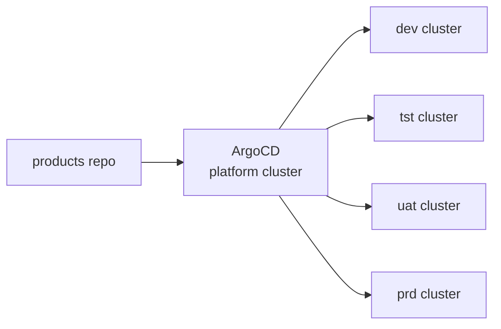
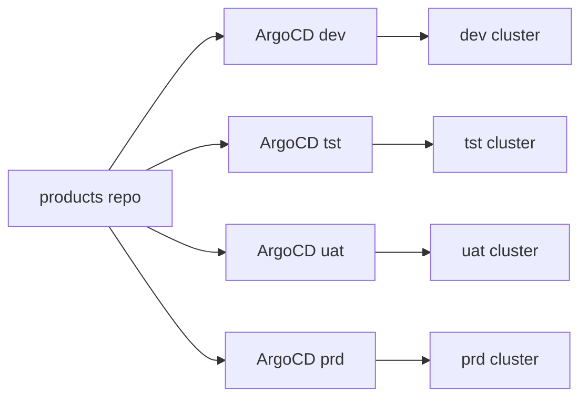
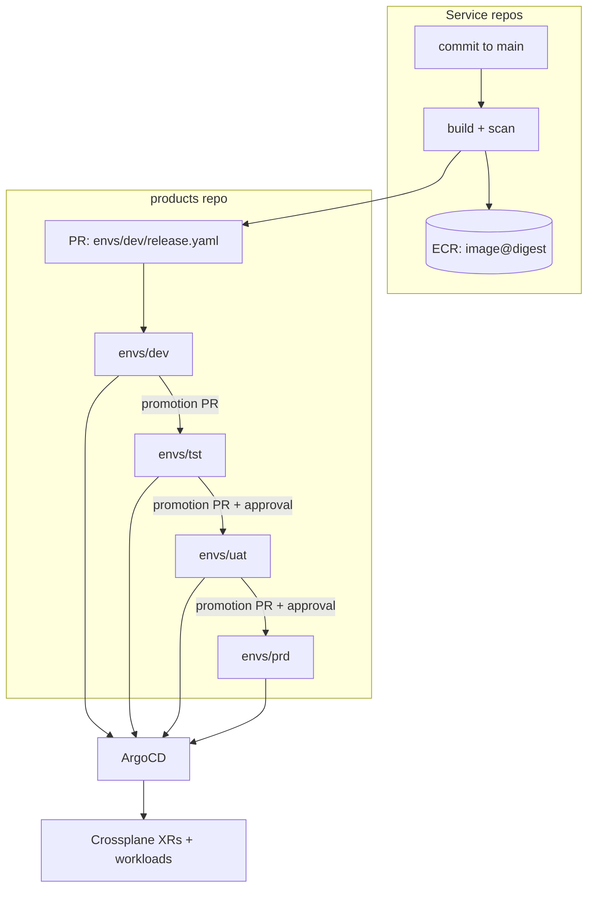

# Environments and Promotion

We are making two changes at the same time, and it is worth separating them before arguing about either.

1. **Push becomes pull.** Today a GitHub Actions runner holds credentials to the target cluster and
   runs `helm upgrade`. We want a commit to land and ArgoCD to converge the cluster onto it.
2. **The service stops being the unit of release.** Today `add-fe` and `add-be` version, gate and
   promote independently. We want a product — frontend, backend, and the infrastructure they need —
   to move through environments as one thing.

Either change is useful alone. Doing both at once is what makes this hard, because the second one
changes *what* is in Git and the first one changes *who reads it*.

This document records where we actually are, the decisions we have to make, what other people do, and
one recommended target to argue with. It does not commit us to anything.

> [!NOTE]
> Everything in "Where we are today" was read out of the repos, not remembered. Paths are given so
> you can check any claim yourself.

## Where we are today

### Applications

The per-repo workflows are generated by `iac-github` and must not be hand-edited — the templates live
in `iac-github/modules/common-repo/templates/atlas_workflows_k8s/`, and the engine they call is
`IAGAI/workflows/.github/workflows/atlas-k8s-deploy.yml`.

| Workflow | Trigger | What it does |
|---|---|---|
| `build-deploy-k8s.yml` | push to `main`, or manual | Build, tag with the 7-char commit SHA, deploy to **dev only** |
| `deliver.yml` | manual only | Cut a semver release, retag the image, walk `tst → uat → prd` |
| `deploy-env.yml` | manual | Push GitHub secrets/variables into the cluster |
| `build-ephemeral.yml` | PR labelled `deploy-pr-N` | Per-PR environment via SQS → Lambda → Helm |

The release train is genuinely good and it is important to understand it before proposing to replace
anything. `atlas-docker-create-release.yml` does **not rebuild** between environments — it retags the
existing manifest in place:

```bash
aws ecr batch-get-image ... | aws ecr put-image --image-tag "$TARGET_TAG"
```

Then `deploy-tst → deploy-uat → deploy-prd` run in sequence, each targeting a GitHub Environment of
the same name. `uat` and `prd` carry `prevent_self_review = true` plus required reviewer teams
(`iac-github/modules/common-repo/atlas.tf`), so those two are the human gates. A security ratchet runs
alongside: `max-critical: 0` at tst and uat, and **additionally `max-high: 0` at prd**, with each stage
passing `prev-critical/high/medium/low` forward so a regression between stages is visible.

The deploy step itself pulls a shared chart from ECR, rewrites its `appVersion`, merges values, and
installs:

```bash
helm pull "oci://${ECR_REGISTRY}/helm/service-deploy" --version "${HELM_CHART_VERSION}" --untar
sed -i "s/^appVersion:.*/appVersion: \"${IMAGE_TAG}\"/" service-deploy/Chart.yaml
helm upgrade --install "$SERVICE_NAME" ./service-deploy \
  --namespace "$SERVICE_NAME" \
  -f /tmp/base-values.yaml -f /tmp/env-values.yaml \
  --server-side=true --force-conflicts --wait --timeout 5m
```

Values come from one file per repo, `.github/k8s-config.yaml` — a `service:` block plus
`environments.<env>:` overrides, deep-merged by `yq`. From `iag-mro-add-fe`:

```yaml
service:
  name: add-fe
  port: 3000
  probes: { path: /health }
environments:
  dev: { replicas: 1 }
  tst: { replicas: 2 }
  uat: { replicas: 2 }
  prd: { replicas: 3 }
```

The single most important line in the whole pipeline is a comment at the top of
`atlas-k8s-deploy.yml`:

> Image is injected into Helm values file, **not tracked in git**.

That is the sentence this entire document exists to change.

### Configuration and secrets

The chart mounts **four** sources, two owned by CI and two by Terraform
(`eks-common/helm/service-deploy/templates/deployment.yaml`):

```yaml
envFrom:
  - configMapRef: { name: <svc>-envs }          # GitHub variables, kubectl-applied by CI
  - configMapRef: { name: <svc>-base-envs }     # Terraform (bootstrap-service/envs.tf)
  - secretRef:    { name: <svc>-secrets }       # GitHub secrets, kubectl-applied by CI
  - secretRef:    { name: <svc>-base-secrets }  # Terraform, synced from Secrets Manager
```

The CI-owned pair is built from `toJSON(secrets)` and `toJSON(vars)` inside the workflow run, filtered
through `.github/.envignore`, and applied with `kubectl` carrying faked Helm ownership labels so Helm
will adopt them. **A cluster's application config therefore exists nowhere except inside a GitHub
Actions run.** Note this now; it is the largest single obstacle to pull-based deploys, and the
Terraform-owned `*-base-*` pair already shows the shape of the fix.

### Registry

One central ECR, account `525426937140` (the cloudtools uat account), repositories named
`<product-family>/<service>` and catalogued in
`cloudtools-aws-mgmt/environments/uat/eu-west-1/base-infra/ecr.auto.tfvars`.

Tag mutability is `IMMUTABLE_WITH_EXCLUSION` with `sb1*`, `dev*`, `tst*`, `uat*`, `prd*` excluded —
moving environment-named tags are deliberately permitted. Worth remembering when we discuss what a
promotion should pin.

### Environments

One AWS account per environment, `eu-west-1` throughout, cluster named `<product-family>-<region>`
(so `ims-eu-west-1`). The master map is `eks_account_ids` in
`cloudtools-aws-mgmt/environments/uat/env.tfvars.json`:

| env | account | notes |
|---|---|---|
| `sb1` | `455919270016` | sandbox |
| `sb2` | `178092210637` | sandbox |
| `sb3` | `515048895486` | sandbox — the Crossplane/ArgoCD PoC domain |
| `dev` | `653847277516` | only automatic app deploy target |
| `tst` | `190845896579` | |
| `uat` | `749559065622` | approval gate |
| `prd` | `607520774133` | approval gate |
| — | `525426937140` | central ECR |

The same account serves every product family at a given environment — `ims`, `agents`, `intellidoc`
and `skynet` all share `653847277516` for dev. The boundary is the environment, not the product.

Two details that will matter later. First, there are **no Terraform workspaces**: separation is
directory plus var-file plus backend key, and every command takes the same two var-files.

```sh
terraform apply -var-file=../region.tfvars.json -var-file=../../env.tfvars.json
```

Second, **`sb3` has no GitHub Environment**. `atlas_environments` in
`iac-github/modules/common-repo/atlas.tf` creates `sb1, sb2, dev, tst, eph, uat, prd` — the PoC
environment is not wired into the application pipeline at all.

### Infrastructure

This is the part most likely to surprise people, so it is worth stating flatly:
**infrastructure is not promoted today.**

`ci-plan-pr.yml` plans every environment on the pull request. On merge, `ci-release.yml` tags
`infra-v` (and `modules-v` when `modules/` changed) and fires a `repository_dispatch`. `deploy.yml`
then fans out to **all four environments in parallel**, each running the wave sequence from
`platform-ims-aws-mgmt/.github/stack-sequence.yaml`:

```yaml
waves:
  - name: base        stacks: [base-ims-infra]
  - name: cluster     stacks: [bootstrap-eks]
  - name: apigateway  stacks: [api-gateway, vpc-attachment]
  - name: services    stacks: [add, cms, newscurator, tief, ...]
```

Each environment gets plan-once-apply-once (a GPG-encrypted `.tfplan` crosses the approval gate), its
own `<env>-lock` kill switch, and its own gate — dev and tst continue automatically, uat and prd
require approval. But they all descend from the same `main` commit, at the same time. Environment
divergence is expressed only by values in `env.tfvars.json` and by which stack directories happen to
exist.

There is one thing that already behaves like promotion, and it is worth naming because it is prior art
for a decision below: when `tf-common-modules` cuts a release, `atlas-bump-platform-versions.yml`
rewrites every `?ref=vX.Y.Z` pin under `platform-ims-aws-mgmt/modules/`. Patch goes straight to `main`,
minor opens an auto-merging PR, major opens a PR needing review. **A bot already writes our version-bump
commits.**

### The Crossplane PoC

`packages/argo-cd/manifests/applicationset-prometeo-products.yaml` is a git directory generator over
`products/*/base` in `crossplane-poc/prometeo-products`, with two deliberate choices: plain manifests
rather than Kustomize, and **no `automated:` block** — merging a PR does not deploy, syncing is a
separate human action.

It is also hardcoded to one environment, in more places than is obvious:

| Where | What |
|---|---|
| `applicationset-prometeo-products.yaml` | Application name `prometeo-{{path[1]}}-sb3` |
| `packages/prometeo-platform/config/50-environment.yaml` | account, cluster, VPC, subnets, `dnsDomain: sb3.ims.iag.ai` |
| `packages/prometeo-platform/packages/22-provider-terraform.yaml` | ECR image and role ARN with the account inline |
| all four Backstage templates | `modules.version: ital-1901-add-sb3-environment` |
| `templates/backstage/service/template.yaml` | output URL `https://<x>.sb3.ims.iag.ai` |

### Prior art we already have and did not port

The `prometeo` design repo solved the environment shape and it never made it into the PoC. It had
`products/<p>/envs/{sb3,dev,tst,uat,prd}/overrides.yaml` — JSON merge patches over a shared `base/`,
carrying exactly the things that legitimately differ:

```yaml
# products/tief/envs/uat/overrides.yaml
apiVersion: platform.prometeo.iag.ai/v1alpha1
kind: AppService
metadata: { name: tief-fe, namespace: tief-fe }
spec:
  image: 525426937140.dkr.ecr.eu-west-1.amazonaws.com/ims/tief-fe:uat
  replicas: 2
```

and one `EnvironmentConfig` per control plane holding everything environment-specific, so that a
component never hardcodes an account and a product manifest never mentions an environment.

The Backstage templates that superseded this write only `base/`. **The scaffolded path is strictly
less environment-aware than the design it came from.** Recovering that is most of the work.

## What today's pipeline already gets right

Before criticising anything, the list of things the new model must not regress:

- **Build once, promote the artifact.** The image that reaches prd is byte-identical to the one tested
  in tst. Many teams get this wrong; we do not.
- **Staged approval gates** that are already wired to teams and already enforce `prevent_self_review`.
- **A security ratchet** that tightens per stage and compares against the previous stage.
- **One shared deployment chart**, versioned and published, rather than a chart per service.
- **One AWS account per environment**, with no cross-environment credential paths.
- **Bot-driven version propagation** with a semver-routed review policy.

The GitOps move does not need to reinvent any of this. It needs to fix exactly one thing: *where the
desired state lives*.

## Two arguments for the per-product release, both home-grown

We do not need to borrow an argument for bundling frontend, backend and infrastructure. We have two of
our own.

**We already built a tool to detect the problem.** `product-deployment-status.py` exists precisely
because frontend and backend promote independently — separate repos, separate ECR repositories,
separate Helm releases, separate namespaces, separate semver counters, and a human running `deliver.yml`
twice. It maps products to repos, queries GitHub Deployments, and marks a cell `X` when only one side
made it. As of the last run in `product-deployments.md`, `frontier` is `X` across dev/tst/uat, and
`portal` and `teco` are `X` in tst and uat. A product-level release makes half-deployed states
unrepresentable rather than detectable.

**The one place that already resembles GitOps is the path we are retiring.** ADD's backend still runs
the deprecated `k8s-deploy.yml@v9`, which promotes by *committing the image to git*:

```bash
case $TARGET_ENV in
  tst) SOURCE_ENV="dev" ;; uat) SOURCE_ENV="tst" ;; prd) SOURCE_ENV="uat" ;;
esac
DEPLOY_IMAGE=$(grep '^image:' k8s/${SOURCE_ENV}/values.yaml | sed 's/^image: *//')
sed -i "s|^image:.*|image: ${DEPLOY_IMAGE}|" k8s/${TARGET_ENV}/values.yaml
git commit -m "chore: update ${TARGET_ENV} image to ${IMAGE_TAG}" && git push origin main
```

Look at what `iag-mro-add-be/k8s/*/values.yaml` says right now:

| env | image |
|---|---|
| dev | `ims/add-be:v0.0.63` |
| tst | `ims/add-be:v0.0.52` |
| uat | `ims/add-be:v0.0.52` |
| prd | `""` |

Eleven versions of drift and a production environment that has never been deployed — legible at a
glance, from a `git log`, without querying anything. That is the property we are trying to buy. The
deprecated path had it by accident; the new one should have it by design.

## The five decisions

Everything else follows from these. Each is separable; we do not have to answer them in order.

### D1 — What is the unit of promotion?

| Option | What moves | Cost |
|---|---|---|
| Image tag | One `image:` field per service | No product-level atomicity; today's problem, in Git |
| Rendered manifests | Fully-rendered YAML per env | Maximum transparency, noisy diffs, needs a renderer |
| Chart version | An OCI chart reference | See the section below — mutable, unreviewable |
| **Release bundle** | One file pinning every image digest plus infra pins | One reviewable diff per promotion; needs a producer |

**Position: the release bundle.** It is the only option that makes "what is in uat" a single-file
answer and half-deployed products unrepresentable. It costs us a small amount of machinery to produce
the file, which is machinery we already have in `atlas-bump-platform-versions.yml`.

Pin **digests, not tags**. Our own ECR policy excludes `dev*`/`tst*`/`uat*`/`prd*` from immutability,
so an environment-named tag is by construction not a promise. A digest is.

### D2 — Where does per-environment state live?

| Option | Shape | Cost |
|---|---|---|
| **Directory per env** | `products/<p>/envs/<env>/` | Obvious diffs, obvious blame; one repo grows |
| Branch per env | `main` → `uat` → `prd` branches | Promotion is a merge; cherry-pick drift, painful history |
| Repo per env | `products-prd` etc. | Hard isolation; N× the scaffolding, templates must fan out |
| Cluster generator + overlay | One dir, ArgoCD picks per cluster | Least duplication; env differences become implicit |

**Position: directory per environment.** It is what `prometeo` already designed, it survives a
`git log`, and it degrades gracefully — an environment that needs something odd gets a file, not a
special case in a generator.

Two concrete things block this today regardless of which option wins: the `-sb3` suffix hardcoded into
the Application name in the ApplicationSet, and `modules.version: ital-1901-add-sb3-environment`
pinned inside all four Backstage templates. Both need to become inputs before a second environment
exists.

### D3 — Who writes the promotion commit?

| Option | Mechanism | Cost |
|---|---|---|
| **GitHub Actions** | `deliver.yml` opens a PR against the products repo | Reuses every gate we have; more workflow code |
| Argo CD Image Updater | Controller watches ECR, writes back | Image-only, cannot carry infra pins; weak audit |
| Kargo | Warehouse → Freight → Stage | Purpose-built; a new controller to operate |
| Human PR | Someone edits the file | Zero machinery; zero enforcement |

**Position: GitHub Actions, at first.** Our approvals, reviewer teams, `prevent_self_review`, and the
Inspector ratchet are all already GitHub Environment features. Moving promotion off GitHub means
rebuilding them somewhere else on day one. See the Kargo note under the recommendation for when that
trade flips.

### D4 — ArgoCD topology

Presented level, with no recommendation — this one depends on how much operational overhead the team
is willing to carry, which is not a question a document can answer.

**Hub and spoke.** One ArgoCD, every environment cluster registered as a destination.



One pane of glass, one Backstage wiring, one bootstrap. But the hub holds credentials into every
account including prd, so its own blast radius is the union of all of them — and today that hub would
be sitting in a sandbox account.

**Per environment.** Each account runs its own ArgoCD reading the same repo, different path.



prd never trusts a sandbox and a broken hub cannot take everything down. Costs four bootstraps, four
upgrade cycles, four Backstage ArgoCD plugin entries, and no single view without extra work.

**Hub for non-prod, separate prd.** The hub covers `sb*`/`dev`/`tst`/`uat`; prd gets its own install in
its own account. Two bootstraps instead of four, one hard boundary where it matters most.

Whichever we pick, note that `packages/appset-chart` already has most of the machinery: its cluster
generator selects on an `environment` label, each addon can carry an `environments:` list mapping a
cluster selector to a chart version, and `_git_matrix.tpl` exists for cluster × git matrices. Today all
of it selects only `environment: control-plane` and the matrix template is unused.

### D5 — Does infrastructure promote with the application?

This is the decision with the largest hidden cost, because it does not extend the current model — it
inverts it. Today infrastructure fans out to four environments in parallel from one commit. A bundle
means it moves through them in sequence.

**Position: bundle it, with a carve-out.** What goes in the bundle is *product-scoped* infrastructure —
the database, the buckets, the queues, the service's IAM. What stays on the current parallel fan-out is
*platform-owned* infrastructure: `base-ims-infra`, `bootstrap-eks`, `api-gateway`, `vpc-attachment`.
Those are shared by every product in the account and have no business being pinned to one product's
release.

Be honest about what we are accepting: infrastructure changes inherit the application cadence, and a
frontend-only fix drags a version number across the whole product. If that friction becomes the
dominant complaint in six months, the fallback is to split the bundle into two tracks that land in the
same environment directory — the layout below supports that without a migration.

## The "package products as Helm charts in ECR" idea

This came up directly, so it gets a direct answer: **right instinct, wrong artifact.**

The instinct — that promotion should move *one versioned thing*, not a scatter of coordinated edits —
is correct, and it is the whole reason for the release bundle in D1. It is also already how the
platform chart works: `eks-common/helm/service-deploy` is packaged and pushed to
`oci://.../helm/service-deploy` on merge, and consumers pin a semver range. That should not change.

For a *product*, an OCI chart is the wrong container for three reasons:

- **OCI tags are mutable.** Chart `1.4.2` today need not be chart `1.4.2` tomorrow. Our own ECR policy
  already excludes environment-named tags from immutability. A promotion that pins something mutable
  has not really pinned anything.
- **The thing that changed is not reviewable.** Bumping a chart version produces a one-line diff that
  says nothing about what is inside. No blame, no line-level review, no bisect. Compare with the
  eleven-version ADD drift above, which is legible from `git log` alone.
- **It splits the source of truth.** The chart lives in ECR, the values live in Git, and "what is
  running in prd" becomes a query against two systems instead of one file.

ArgoCD does support OCI sources, so this is a trade rather than an impossibility. It is simply a bad
trade for the thing we most want, which is a Git-answerable production state.

The version of the idea that works keeps the bundle and changes the container: a per-environment
`release.yaml` in Git, pinning image digests and infrastructure versions. Same "one thing to move"
ergonomics, plus review, blame, diff and revert.

## How other people do this

Honest summary, including where the public record runs out.

**Spotify.** Golden paths are implemented as Backstage Software Templates; Tingle builds and deploys
and reports status back into Backstage. The transferable detail is smaller and more useful than the
architecture: Backstage models environments *outside* the catalog. One `Component`, many ArgoCD
Applications, joined by the `argocd/app-selector` annotation rather than by creating an entity per
environment.

**CNOE — AWS, Adobe, Autodesk, Salesforce, Twilio.** The reference implementation this repo is forked
from is deliberately single-cluster. Multi-environment is left to the adopter. That is the most useful
fact in this section: nobody upstream has done this homework for us, and the gap in our fork is the
same gap that exists in the original.

**The Argo ecosystem.** The consensus is directory-per-environment with rendered or near-rendered
manifests, automatic sync low in the pipeline and gated sync high. Kargo formalises promotion above
ArgoCD — a Warehouse subscribes to image and Git sources, a Freight is a versioned bundle of artifacts
that moves as a unit, and Stages promote Freight with verification between them. That is precisely the
shape D5 asks for, which is worth knowing before we build a bespoke version of it.

**Crossplane.** CompositionRevisions with a `Manual` update policy are the supported answer to "a
composition change must not reach every environment at once". Without this, editing a Composition is a
simultaneous change to every XR that uses it, in every environment.

**Cisco.** Frequently cited as a large Backstage adopter, but their internal promotion model is not
publicly documented in enough detail to cite responsibly. Better to say so than to invent it.

## A recommended target



**Repository layout.** Environment-independent facts in `base/`, everything that legitimately varies in
`envs/<env>/`:

```
products/add/
├── catalog-info.yaml
├── base/                    # what ADD is, in any environment
│   ├── namespace.yaml
│   ├── product.yaml
│   ├── frontend.yaml
│   ├── backend.yaml
│   └── database.yaml
└── envs/
    ├── dev/{release.yaml,overrides.yaml}
    ├── tst/{release.yaml,overrides.yaml}
    ├── uat/{release.yaml,overrides.yaml}
    └── prd/{release.yaml,overrides.yaml}
```

**The bundle.** One file is the unit of promotion, and promoting is copying it forward:

```yaml
# products/add/envs/uat/release.yaml
version: v1.4.2
images:
  frontend: 525426937140.dkr.ecr.eu-west-1.amazonaws.com/ims/add-fe@sha256:...
  backend:  525426937140.dkr.ecr.eu-west-1.amazonaws.com/ims/add-be@sha256:...
infra:
  modulesVersion: v6.5.1
  compositionRevision: appservices.platform.prometeo.iag.ai-a1b2c3d
```

**Who does what.** GitHub Actions keeps building, scanning, cutting releases and enforcing the
Inspector ratchet — none of that moves. What changes is the last step: instead of `helm upgrade`, the
workflow opens a pull request that copies `release.yaml` from one environment to the next. Approvals
stay in GitHub Environments, where the reviewer teams already are.

**Sync policy.** Automatic in `sb*` and `dev`; manual or PR-gated in `uat` and `prd`. This preserves
today's property that nothing reaches production without a human, while removing the manual sync step
from environments where it is only friction.

**Environment facts.** One `EnvironmentConfig` per environment supplies account, VPC, subnets, domain
and defaults, so a product manifest never names an environment. This is already the design — it needs
N instances instead of one, and `generate-environment-config.sh` needs to come across from `prometeo`,
where it currently lives but the PoC does not have it.

**Backstage.** One `System` per product with an `argocd/app-selector` annotation so every environment
appears on one page, rather than an entity per environment. Templates write `base/` plus every
`envs/<env>/`, with the environment list and module version becoming template inputs instead of
hardcoded strings.

**Secrets — do this first.** Replace the GitHub-secrets-to-`kubectl` push with External Secrets
reading from Secrets Manager or SSM. Until this is done, ArgoCD cannot reconstruct a namespace on its
own, because half of what the namespace needs only exists inside a workflow run. The Terraform-owned
`<svc>-base-envs` and `<svc>-base-secrets` already work correctly and are the pattern to extend. This
is the dependency that gates everything else, and it is easy to underestimate because it is invisible
until the first cluster is rebuilt.

**Start without Kargo.** Everything above works with tools we already run. Adopt Kargo when one of two
things becomes true: promotion needs verification that outlives a workflow run (soak time, progressive
analysis, automatic rollback on a metric), or more than about three products are promoting on
independent cadences and the hand-rolled promotion workflows start diverging from each other.

**Ephemeral PR environments stay push-based.** They are created and destroyed by label, live for
hours, and have no promotion story. GitOps is for durable environments; forcing per-PR namespaces
through a Git repo buys nothing and adds commit noise.

## ADD, sketched

| Today | Target |
|---|---|
| `build-deploy-k8s.yml` → build + `helm upgrade` to dev | `build-deploy-k8s.yml` → build + scan, then PR to `envs/dev/release.yaml` |
| `deliver.yml` → retag, then deploy tst/uat/prd | `deliver.yml` → retag, then open promotion PRs; ArgoCD deploys |
| `.github/k8s-config.yaml` per repo | `base/*.yaml` plus `envs/<env>/overrides.yaml` in the products repo |
| Image known only inside the workflow run | Image digest pinned in `envs/<env>/release.yaml` |
| FE and BE promoted separately, twice | One `release.yaml` naming both |
| Secrets pushed by `kubectl` from CI | External Secrets from Secrets Manager |

ADD is unusually messy to start from — its backend is on the deprecated v9 pipeline while its frontend
is on the current one, so a migration has to normalise them before it can bundle them. That is
tractable, but it makes ADD a worse pilot than it first appears. See the open questions.

## Open questions

- **Cluster per environment, or shared?** Today `<family>-<region>` gives one cluster per family per
  account. Nothing above depends on the answer, but D4 does.
- **Do `sb*` participate in promotion?** They have no GitHub Environments today, `sb3` included — the
  PoC environment is invisible to the application pipeline. Either wire them in or declare them scratch.
- **Who approves `release.yaml`?** The product team, the platform team, or both. Today the approval is
  on the deploy job; moving it to a PR changes who is in the loop.
- **Native Crossplane components, or Terraform workspaces?** We have two catalogs with identical APIs
  and opposite implementations — `prometeo/platform/components/` composes AWS managed resources
  directly, `packages/prometeo-platform/components/` composes one Terraform `Workspace` each. A reader
  of a product manifest cannot tell which. This will bite the moment promotion starts, because they
  have different failure modes, different rollback stories and different answers to "pin the
  infrastructure version".
- **Backstage or GitHub as the promotion UI?** Backstage can trigger it; GitHub already has the
  approvals. Doing both means two places to look.
- **Is ADD the right pilot?** Both `iag-mro-add-be` and `iag-mro-add-fe` are wired through
  `common-archived-repo` in `iac-github`, and the two sit on different pipeline generations. A product
  already on the current pipeline with both sides healthy would prove more with less yak-shaving.
